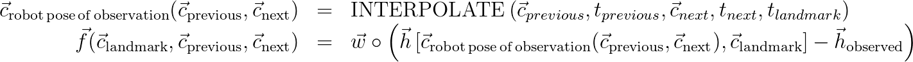

# Landmark observations
Add landmarks support to Cartographer.

## Summary
[summary]: #summary
Cartographer will be able to work with a new type of sensor data that contains IDs and locations of landmarks.

## Motivation
[motivation]: #motivation
Landmarks translation/orientation can improve SLAM quality. Landmark visualizations can be useful for inspection.

## Approach
[approach]: #approach
Landmarks are sparse features of geometry that we want to map. Unlike dense range data, landmarks are assumed to be sparse in comparison. In order to support using them, current SLAM approach has to be generalized. 

### Sensor
Each landmark will have an ID and a position relative to the robot with or without orientation. A landmark observation can contain several landmarks at a time.

```
struct Landmark {
  std::string id;
  transform::Rigid3d transform;
  double translation_weight;
  double rotation_weight;
};

struct LandmarkData {
  common::Time time;
  std::vector<Landmark> landmarks;
};
```

### Pose graph
Pose graph will collect and store information about all observations provided by sensors.
```
mapping::MapById<mapping::LandmarkId, mapping::LandmarkNode>
```
where `LandmarkNode` contains all the global pose of the landmark and all landmark observations:

```
LandmarkNode {
  LandmarkObservation {
    common::Time time;
    int trajectory_id;
    
    transform::Rigid3d transform;
    double translation_weight;
    double rotation_weight;
  };
  std::vector<LandmarkObservation> landmark_observations;
  transform::Rigid3d global_pose;
};
```
Note, that the `global_pose` is a vector of optimization parameters. Before the first sparse pose optimization run we can store extrapolated pose here instead and use it for rendering. Another option would be not populating the `global_pose` at all and not rendering the respective landmark on the map before optimization.


### Optimization
Landmarks will enter sparse pose graph optimization as additional independent variables. It increases the dimension of the optimization by `number_of_landmarks * number_of_parameters_per_landmark`, which could be undesirable when there is a significant number of landmarks. 

#### Cost function
Landmark sensor data contains only the landmark position relative to the robot. In order to formulate a landmark-to-trajectory cost functional the global pose of the robot at the moment of the observation has to be known. Since a landmark observation can be made at the time between two trajectory nodes and, moreover, the global poses of the trajectory nodes are state variables as well, the translation and rotation of the landmark at the moment can be interpolated using the previous and the next node, i.e. taking a convex combination of the translation components and slerp of the quaternions. This logic is already implemented within `TransformInterpolationBuffer`. 

Residuals depend on the parameter block `[c_previous, c_next, c_landmark]`, i.e. on the global poses of the previous and next trajectory nodes and the global pose of the landmark itself:



where `w` is the weight vector; `c` denotes global poses and `h` relative ones. 

There will be no loss function as for intra submap constraints. 

#### Constraints
The cost function for landmark-to-trajectory constraints depends on the previous and next trajectory nodes. They are not known at the moment when the sensor data comes, but we can find them prior to the `RunOptimization` call using `AddWorkItem()` for landmark observations that were not yet processed.

There are two ways of storing the landmark constraints in `PoseGraph`:

1.  as a separate `std::vector<LandmarkConstraint> landmark_constraints_`, which would bloat the `PoseGraph` even more. Since the next RFC will talk about adding landmark-to-landmark constraints, I would try to avoid this option.
1. in the current `std::vector<Constraint> constraints_`, which would lead to expanding the `Constraint` struct and adding  a new value to `enum Tag { INTRA_SUBMAP, INTER_SUBMAP } tag;`

I think the second option is a bit cleaner. Both are ugly though.


### Rendering
Landmarks IDs and positions should be propagated to RViz for rendering.

## Discussion Points
[discussion]: #discussion
